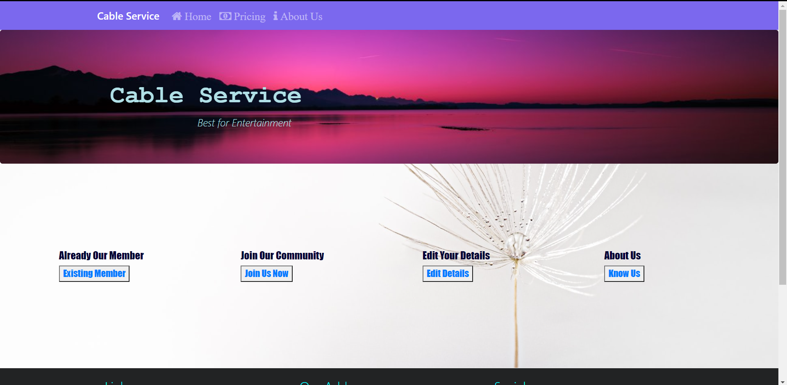
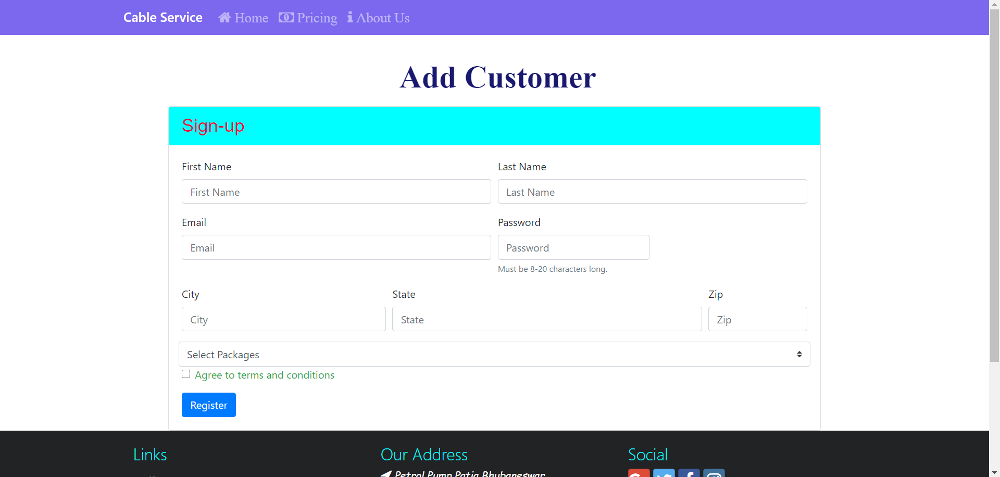
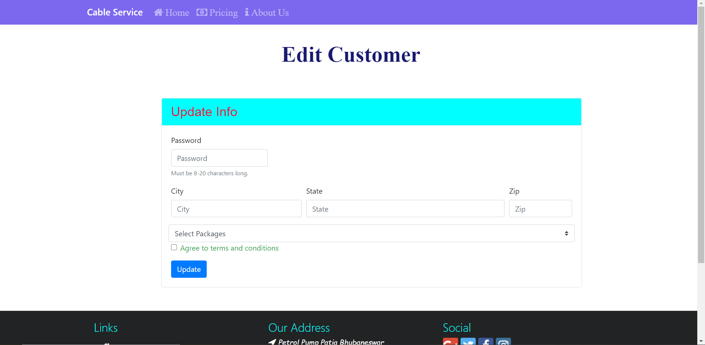
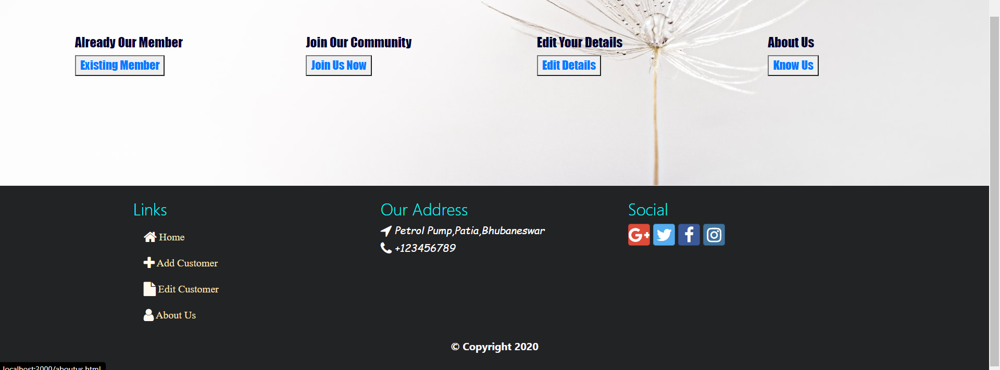

# Cable Service Management System (CSMS)
- This is a web application that makes management of customers and their billing easier for the Service Providers.
- This application is fully responsive and developed with mobile-first framework Bootstrap 4.

## Screenshots

## Getting Started
To get the Node Server running locally: 
- `npm install` to install all required dependencies.
- `npm run dev` to start the local server.

## Added Bootstrap to Project
- `npm install bootstrap` to install bootstrap into this application.
- `npm install bootstrap-social` to install Social Buttons in this application.

